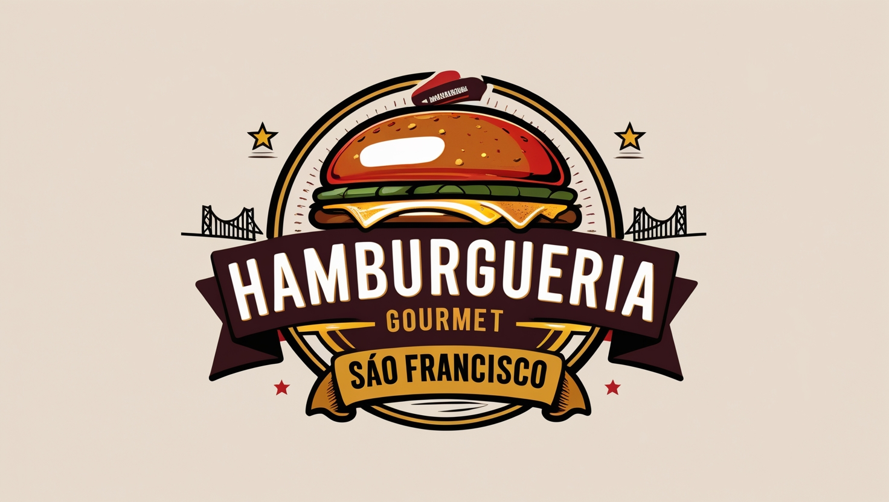
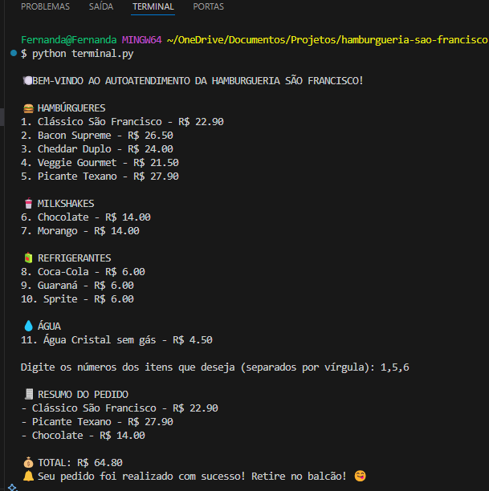

  

<h1 align="center">Hamburgueria São Francisco </h1>

  

---

##  Descrição do Projeto

Projeto backend de um sistema de autoatendimento para uma hamburgueria fictícia chamada **Hamburgueria São Francisco**, criado como desafio para treinar habilidades com **Docker**, **Python** e organização de containers.  
Neste projeto, o foco é permitir pedidos via terminal, simulando uma experiência de autoatendimento onde o usuário escolhe itens do cardápio e recebe o total com a confirmação final.

##  Funcionalidades do Projeto

- Exibição de cardápio com hambúrgueres, milkshakes, refrigerantes e água
- Escolha de itens via terminal
- Cálculo total do pedido
- Mensagem final personalizada com confirmação do pedido
- Backend com Flask pronto para ser containerizado com Docker

##  Testes de Software

- Teste de exibição do cardápio completo com preços
- Teste funcional via terminal para simulação de pedido
- Execução do Flask confirmada via terminal
- Simulando o atendimento:

##  Tecnologias e Linguagens Utilizadas

##  Bibliotecas e Frameworks

---

## ⚖️ Licença ⚖️

Este projeto está licenciado sob a **Licença MIT (Massachusetts Institute of Technology)** — uma licença de software permissiva amplamente utilizada que garante liberdade para uso, cópia, modificação e distribuição, com poucas restrições.

> Ao utilizar este projeto, é necessário manter o aviso de direitos autorais original e incluir uma cópia da licença em todas as cópias ou partes substanciais do software.

Para mais informações, consulte o arquivo [LICENSE](./LICENSE).
